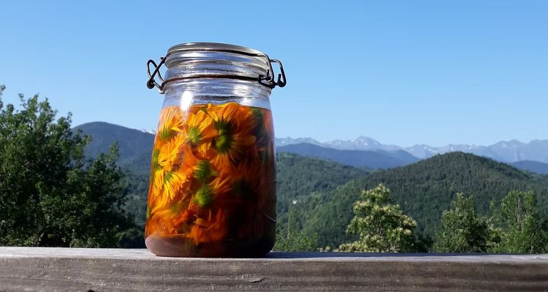

C'est sur les pentes montagneuses, que s'expérimente une culture où, le lien avec les plantes et leurs principes de vie sont considérés primordiaux. La nature créée et c'est une source d'observation merveilleuse.

L'Atelier des champs s'inspire du monde végétal pour nourrir plusieurs domaines :

- agriculture, soin et design

Grâce à la relation aux plantes, à leur médecine, à leur graphisme, leur organisation architecturale, à leur pigment pour teindre, la rencontre avec le monde végétal est source d'éveil et de créativité.

​C'est une immersion totale à partager.  
Une relation à notre environnement.

- vente directe : de mars à juin + sept./oct. sur les marchés (Massat, Soueix, Muret+ marchés aux plantes voir calendrier sur [le site](https://atelier-des-champs.wixsite.com/my-site/))
- épicerie : de mars à octobre : Association le Jardins des 7 vallées à Massat, Magasin de producteurs : La récolte paysanne à St Girons

- Labellisés AB Bio
- Nature & Progrès

