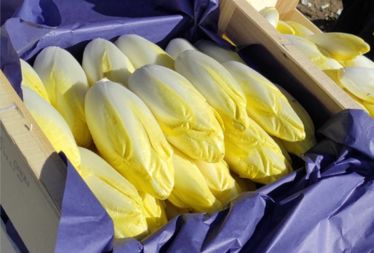

## description

Delphine cultive des endives de manière artisanale à Massat depuis 2021. Après deux années à Pieusels, elle a déplacé son endiverie vers Massat, où elle produit des endives certifiées AB Qualisud. Le respect de la charte Biocoop lui permet de fournir les marchés locaux. Contrairement aux pratiques industrielles, ses endives sont forcées dans du sable et du terreau de brebis de Mourès, donnant des endives plus petites, fermes et moins amères que les endives conventionnelles.

