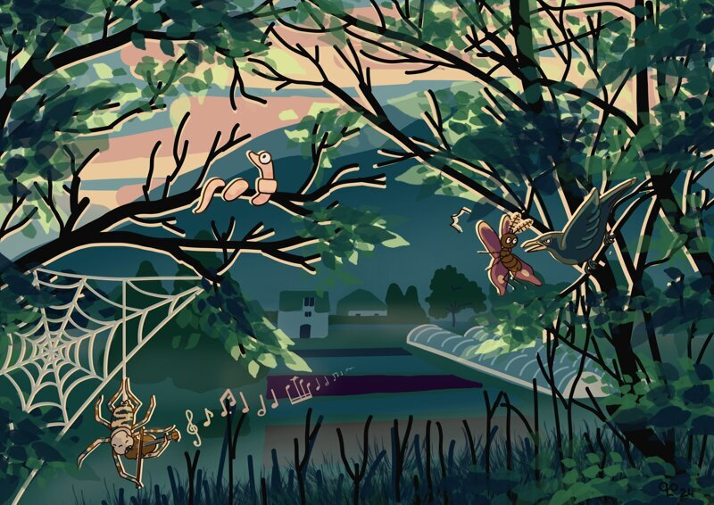

## description

La Ferme des Légumes et des Rêves, située dans la vallée de l'Arac, est un modèle d'agriculture locale et durable. Fondée par Hélène Decarpignies, elle se distingue par son engagement envers la souveraineté alimentaire, la permaculture et une autonomie écologique exemplaire. La ferme vend des légumes, des fruits et des céréales cultivés sur place, et elle participe activement à la vie locale en approvisionnant des cantines, des épiceries et des restaurateurs de la vallée. Hélène organise également des événements culturels, mêlant la musique et l'agriculture, pour inspirer les visiteurs. La ferme est autosuffisante en énergie grâce à l'utilisation de panneaux solaires, à l'eau de source et à une approche respectueuse de l'environnement, faisant d'elle un exemple de sobriété heureuse et de vivre ensemble en harmonie avec la nature.

