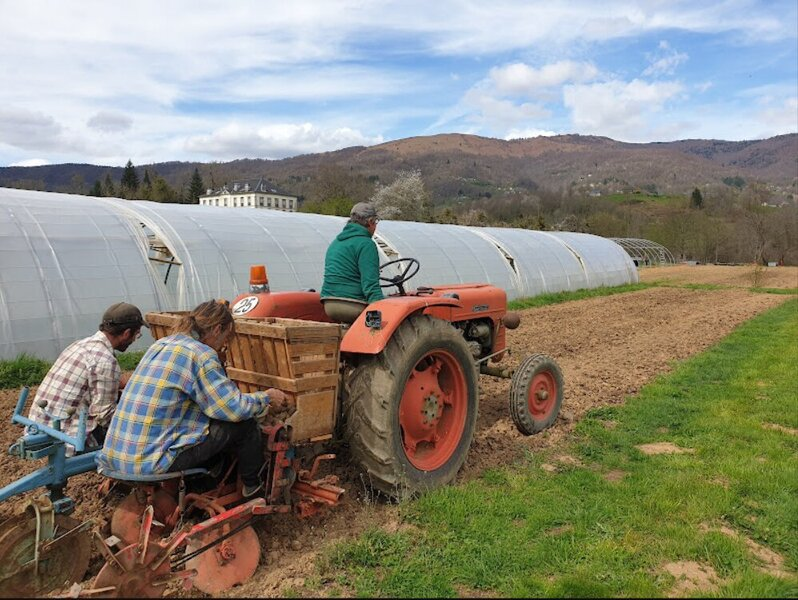

## description

Le Jardin d'Andi, situé à Massat, est un véritable lieu de charme où vous pouvez acheter des légumes, des fruits, et des plants cultivés avec soin. Arrivé dans les années 70, Andi a joué un rôle essentiel dans le développement de l'agriculture biologique dans la région. Le jardin ne se limite pas à la production, il est aussi un espace de convivialité avec des événements réguliers, comme des séances de contes pour tous les âges, souvent accompagnées de petites restaurations biologiques (ré-ouverture au printemps).

