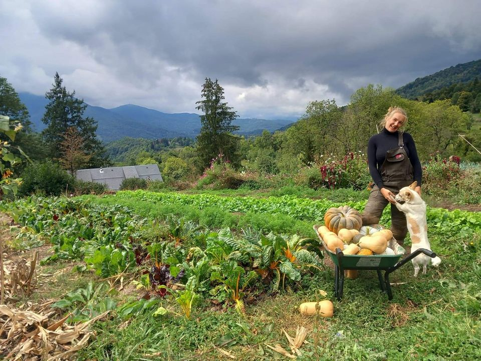

## description

Le Jardin de Neitah est une exploitation maraîchère biologique située dans le hameau d'Eycherboul, à 900 mètres d'altitude, au cœur des montagnes ariégeoises. Engagé dans une agriculture respectueuse de l'environnement, le jardin propose une variété de légumes frais et de saison. Les produits sont disponibles en vente directe à la ferme et à l'épicerie bio de Massat. Cette initiative locale favorise les circuits courts et offre aux habitants des produits sains et locaux.

