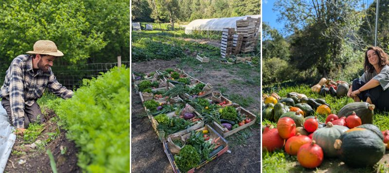

## description

Nous sommes Odile et Romain, un couple de maraîchers sur petite surface à la sortie de massat (lieu dit du Guioulat).  

Nous sommes fraîchement installés depuis 2 ans, cultivons en bio et proposons une vente en direct de paniers de légumes hebdomadaires.
Inspiré du système des AMAP mais sans engagement, ce système nous permet de vendre une bonne partie de notre production.  

Nous vendons aussi nos légumes aux commerces locaux tels que l'épicerie des 7 vallées, le restaurant du Gypaète Barbu et autres.  

En complément, nous transformons une partie de nos produits et vendons des soupes de courges l'hiver et des galettes bretonnes au printemps.  

Romain s'émoustille pour le orange d'un bon potimarron et Odile craque pour le vert du haricot vert.  

