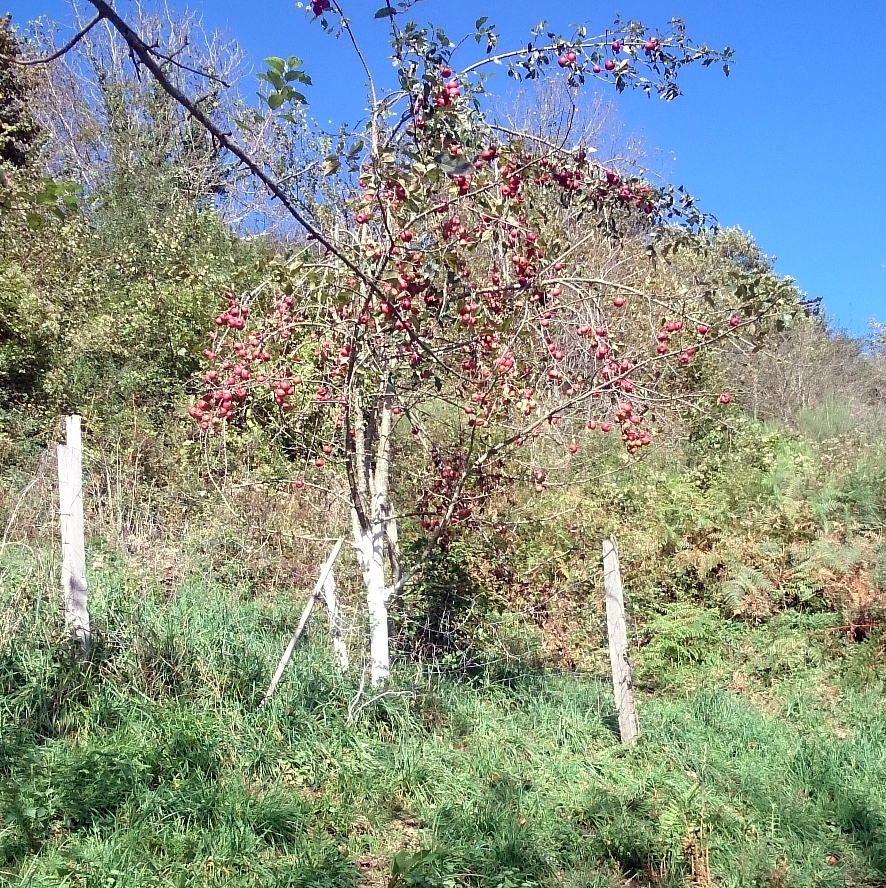

## description

Les vergers d'Aleu sont conduits en Agriculture Biologique depuis 2013 par Agnès Rael sur deux hectares situés sur la commune d'Aleu : "Pour accompagner mes arbres j'ai choisi le plein vent, la forme libre et la taille douce. Les traitements à base d'extrait de plantes et huiles essentiels stimulent les défenses naturelles de la plante. Les amendements avec les ressources disponibles, le BRF et le guano de mes poules entretiennent un sol vivant."  
Je propose des fruits (pommes, poires, coings, poires, raisins et figues) et mes jus de fruits, cidre, et vinaigre  à la vente sur le marché de Soueix tous les mercredi après-midi, au Jardin des 7 Vallées, à l'épicerie du chateau de Seix et à la supérette Vival à Oust.  

