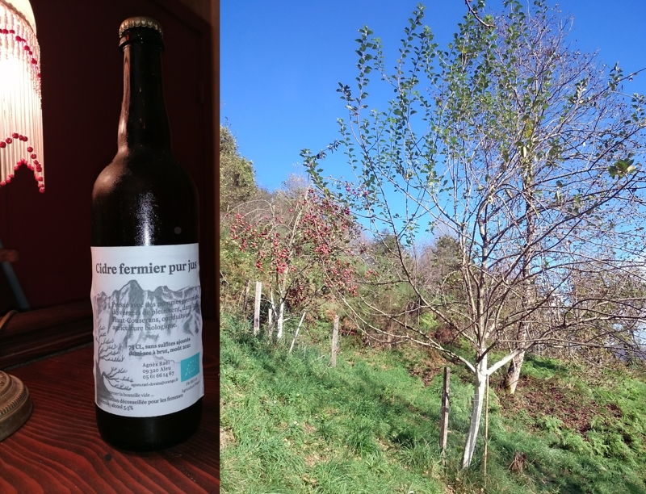

## description

Les Vergers d'Aleu, situés dans le hameau de Biech à Aleu, sont gérés par Agnès Raël. La ferme produit des fruits, des légumes diversifiés, du jus, du cidre, des vinaigres, des mousseux, des confitures, ainsi que des noix. L'ensemble de la production est biologique, et les produits sont disponibles à la vente à la ferme sur rendez-vous, ainsi que sur le marché de Soulan et de Soueix.

