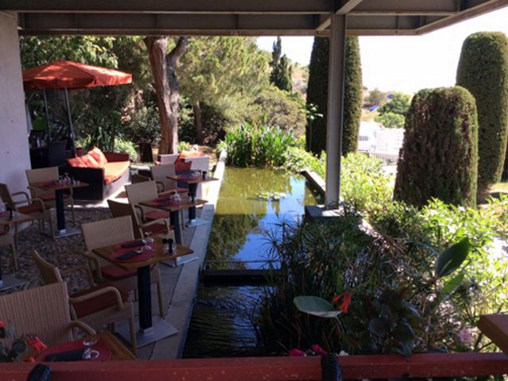

## description

Les Massatois en mal de fraîcheur et de calme s'y rendent volontiers. Jouxtant le célèbre cimetière marin, sur le flanc du mont Saint-Clair, et collés au musée Paul-Valéry, la terrasse ombragée et son petit bassin à poissons rouges où flottent papyrus et nénuphars offrent une superbe vue sur la mer.
Nathalie Richin vient de prendre les cuisines de l'ancienne brasserie des arts et propose une cuisine meridionale, remplie d'accents sétois.

