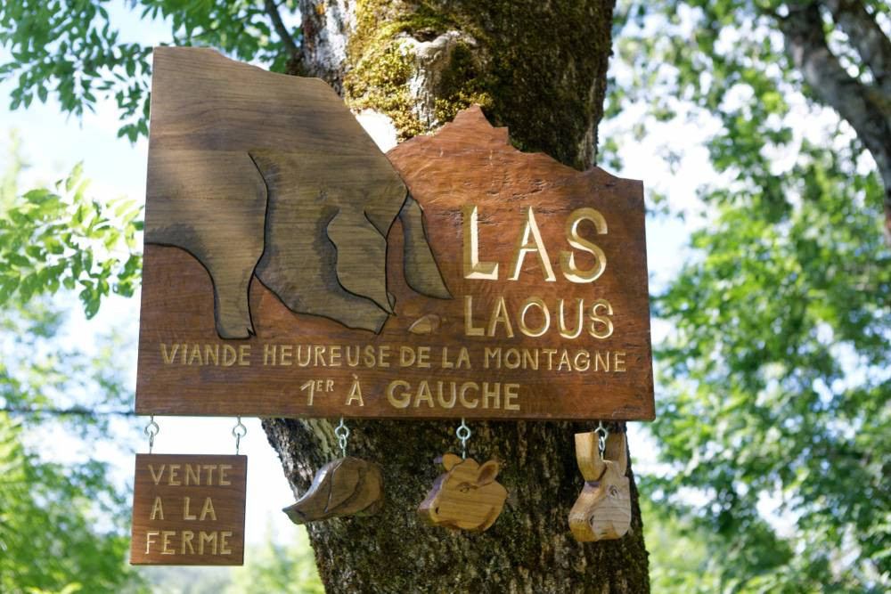

## description

Située à 900 m d'altitude, dans la vallée de Massat, au cœur des Pyrénées Ariégeoises, la Ferme de "Las Laous" est perchée à flanc de montagne. C’est là que nous nous sommes lancés, en 2005, dans l’élevage de porcs gascons.  
Le porc gascon, race de cochon noir, très rustique, adore fouiner dans la forêt… Nous les nourrissons avec des céréales garanties sans OGM, et l’automne, ils se régalent de glands et châtaignes ! C’est cette alimentation, associée à la race, qui confère à notre viande son goût exceptionnel !  
Nous croyons dans le fait qu’il est possible, aujourd’hui, de produire une viande de qualité en montagne, tout en préservant notre environnement et en rendant nos bêtes heureuses.

