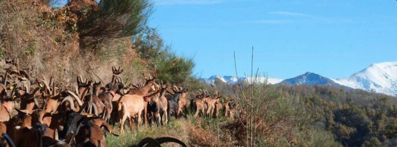

## Description

La Ferme des Brus à Soulan est spécialisée dans l'élevage caprin en agriculture biologique. Christel et Fabrice y élèvent une soixantaine de chèvres, produisant une variété de fromages (lactiques frais, mi-secs, secs, cendrés et tommes de montagne). La ferme valorise une agriculture respectueuse de l'environnement, utilisant des méthodes durables et offrant des produits de grande qualité.

