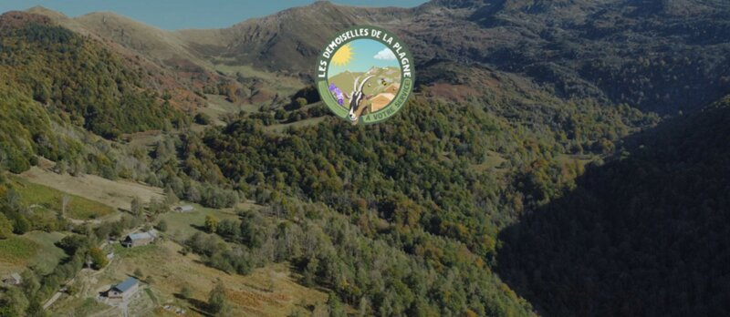

## Description

LE GAEC Les Demoiselles de la Plagne est une exploitation familiale au coeur de l’Ariège. Nous vous proposons fromages de chèvre au lait cru entier issu de pâturages de montagnes ainsi que du Miel des fleurs de montagne.

