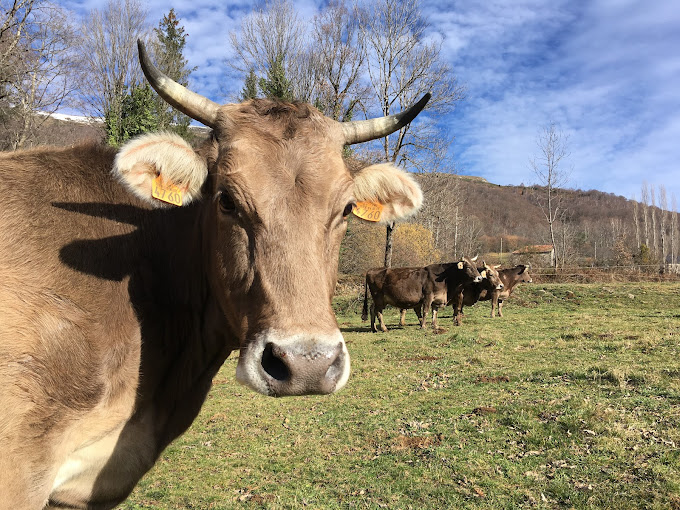

Le GAEC Les Vieux Prés est une exploitation agricole située dans le hameau d'Eychervidal, à Saurat, en Ariège. À 1000 mètres d'altitude, sous le Col de Port, la ferme s'étend sur une quarantaine d'hectares certifiés biologiques. Le troupeau, composé d'une quinzaine de vaches des races Brunes des Alpes et Montbéliardes, pâture sur les prairies environnantes tout au long de l'année. La production est responsable, avec une alimentation principalement issue de la ferme, garantissant ainsi un lait de qualité. Dans leur fromagerie, Romain et Christine transforment l'intégralité du lait sur place, maîtrisant chaque étape de la production jusqu'à la vente. 

Les produits proposés incluent des fromages fermiers au lait cru de vache certifiés biologiques, notamment de la tomme affinée plusieurs mois en cave. Selon la saison, d'autres produits laitiers viennent compléter l'offre. La vente se fait à la ferme uniquement sur rendez-vous et au marché de Tarascon-sur-Ariège le samedi matin.

