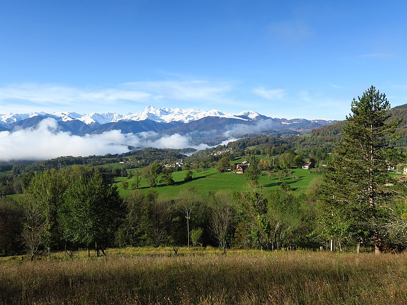

## Description

Le GAEC du Verger, situé à Ardichen dans la commune de Soulan (Ariège), est une exploitation agricole fondée en 2003. Spécialisée dans l'élevage de vaches laitières, la ferme produit des fromages et des yaourts artisanaux. Sous la direction de Françoise Sarramalho, le GAEC du Verger privilégie la vente directe, permettant aux consommateurs de bénéficier de produits frais et locaux.

