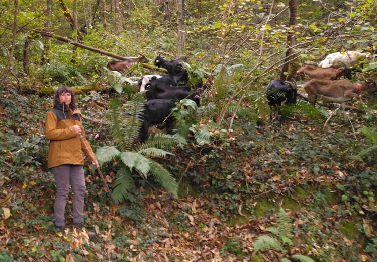

## Description

La Chevrotine, c’est Laurine et Rémi, passionné·e·s de nature et de savoir-faire locaux. Ils fabriquent des fromages de chèvres et de brebis et Laurine travaille avec ses deux juments Mérens pour du débardage, du portage en montagne, et des conseils pratiques en traction animale. Rémi, lui, transforme le bois local avec sa scierie mobile. Ensemble, ils cultivent des produits et services authentiques en circuit court, en harmonie avec la vallée de l’Arac.

