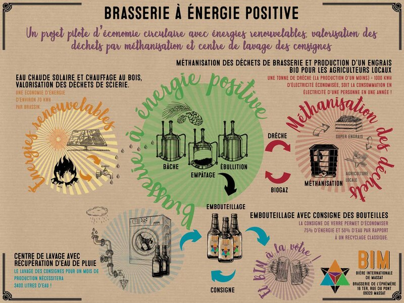

## description

La Brasserie BIM (Bière Internationale de Massat), aussi connue sous le nom de Brasserie de l'Éphémère, est une brasserie artisanale située à Massat, en Ariège. BIM propose une gamme variée de bières artisanales, toutes brassées à partir d'ingrédients issus de l'agriculture biologique, notamment de l'eau de montagne. Parmi leurs créations, on trouve des bières blondes, ambrées, blanches, et IPA, chacune avec des arômes spécifiques obtenus grâce à un mélange unique de houblons. La brasserie accorde également une grande importance à la durabilité, en utilisant un procédé de nettoyage manuel pour la consigne des bouteilles. Les produits de la Brasserie BIM sont disponibles à la brasserie, ouverte les jeudis et vendredis pour les visites et les achats.

