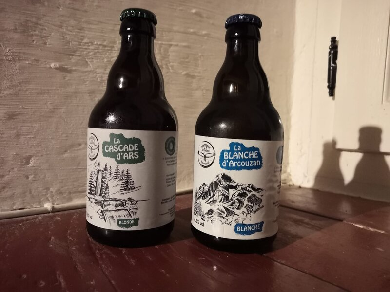

## description

La Brasserie des Trois Seigneurs est une microbrasserie située à Soulan, en Ariège, qui se spécialise dans la production de bières artisanales de qualité. Elle est connue pour sa bière brassée dans un cadre rustique et convivial, utilisant l'eau pure de la région. La brasserie propose ses bières en vente directe sur place, et est souvent appréciée pour son accueil chaleureux. Elle est ouverte de manière ponctuelle, pour ceux qui souhaitent goûter leurs bières sur place

