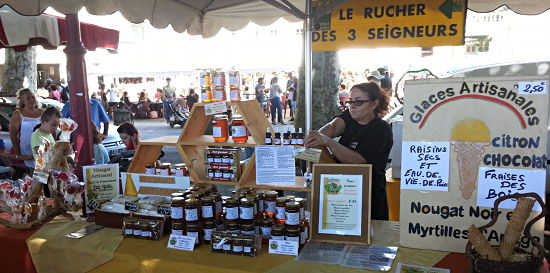

## description

Le Rucher des 3 Seigneurs est une entreprise apicole située à 900 mètres d'altitude près de l'étang de Lers et du pic des 3 Seigneurs. Les abeilles butinent une flore montagnarde riche et variée, produisant un miel de montagne de qualité. L'apicultrice récoltante, Noëlle Morales, transforme également le miel en confiseries artisanales telles que nougats, pains d'épices et sucettes, élaborées avec des ingrédients issus de l'agriculture biologique et traditionnelle. Le rucher propose aussi de la propolis. Les produits sont disponibles à la vente sur place et lors de marchés locaux en Ariège.

