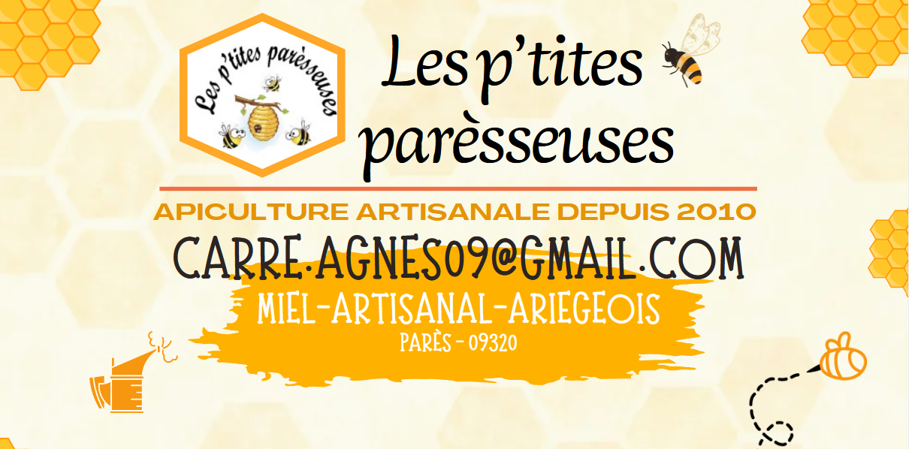

## description

Situé au cœur des Pyrénées - Ariégeoise, dans le petit hameau de Parès,
Agnès Carré récolte amoureusement pour vous cet or merveilleux qui
caressera vos papilles au petit déjeuner, au goûter, ou lors d’un instant suspendu autour d’un thé...  
Des produits 100% locaux !

