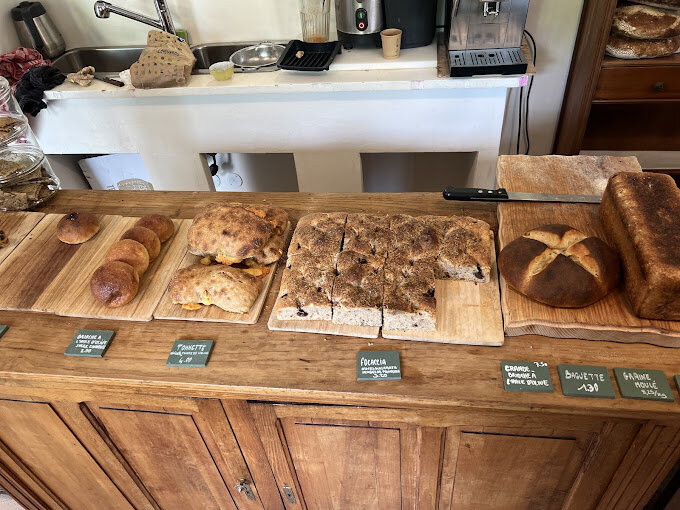

## description

Julie et Victor, un couple passionné, ont redonné vie à la boulangerie communale, « L'Espies Joyeux », après deux ans de fermeture.  Originaires de Bourgogne, ils sont tombés amoureux du Couserans et ont choisi de s'y installer. Victor, aux fourneaux, se spécialise dans les pains rustiques au levain, vendus au poids, issus de farines complètes et travaillés avec un meunier du Gers. Julie, quant à elle, assure le service. Ensemble, ils proposent des produits bio, des pains, des viennoiseries et bientôt des recettes salées.

