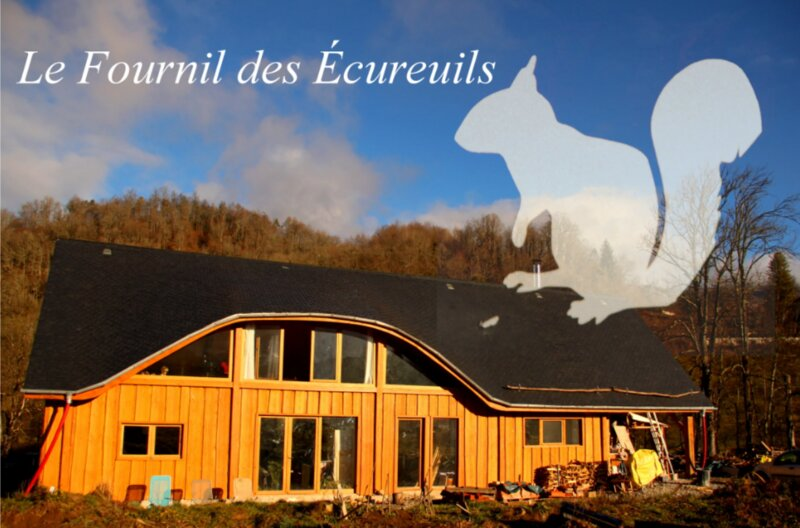

## description

Le Fournil des Écureuils propose des pains biologiques au levain, cuits au feu de bois et préparés avec des farines bio. Leur gamme inclut du pain de campagne aux graines et des brioches, tous pétris à la main avec soin, pour offrir des produits authentiques et artisanaux.

