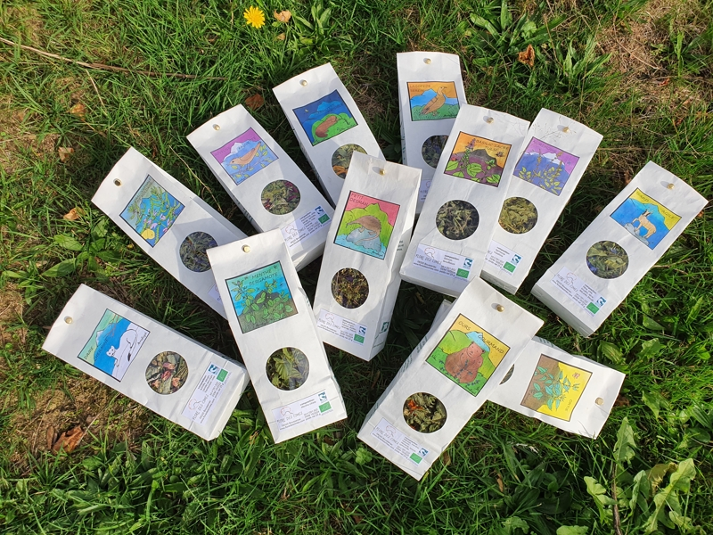

## Description

Flore des Cimes est une ferme agroécologique de montagne qui vous propose une gamme de produits issus de la cueillette sauvage et de la culture de plantes aromatiques, fruits et petits fruits. Les mentions Nature & Progrès et Agriculture Biologique garantissent des pratiques respectueuses de l’environnement et des produits de qualité.  

Flore des Cimes partage sa passion des plantes et anime des ateliers de formation pour vous faire rencontrer les plantes et découvrir les trésors qu’elles ont à nous offrir.  

Située à Boussenac, sur le versant ensoleillé des Pyrénées Ariégeoises, la ferme profite d’un territoire préservé des pollutions et des rigueurs d’un climat qui renforce le caractère des plantes. Celles-ci sont cultivées naturellement, en harmonie avec l’environnement: pas de pesticides mais des préparations végétales, nettoyage et enrichissement des terrains par des animaux, paillage et associations bénéfiques.  

La gestion de la ferme se fait avec une vision globale afin de recréer un écosystème le plus stable possible et de réduire au minimum les interventions extérieures.  

