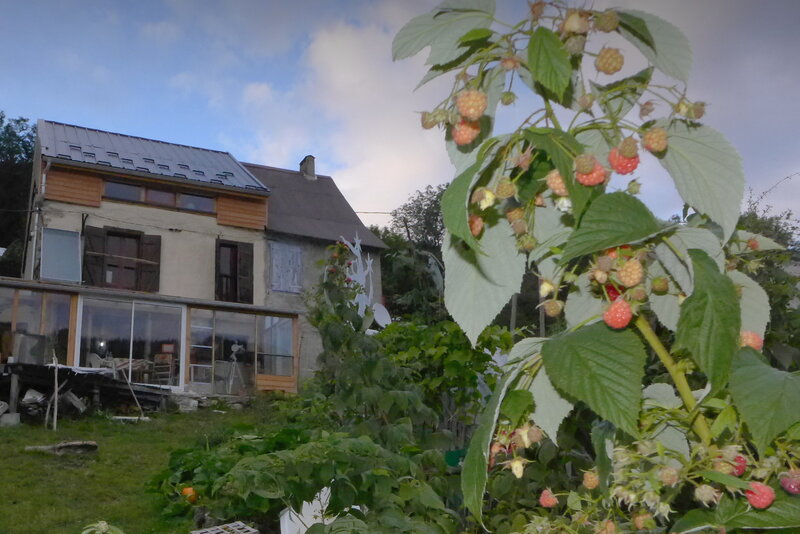

## Description
 Le projet « Regards dans les arbres » est né en 2016 à Massat, avec une approche fondée sur la permaculture, l'autoconstruction et la création d'un oasis de biodiversité. Odile et Romain y cultivent des fruits, légumes, herbes et autres plantes avec soin, tout en transformant une partie de leur production en confitures, compotes et liqueurs. Ce lieu est un espace de partage, de respect de la nature, et d'expérimentation vers une vie plus sobre et autonome, où chaque visiteur peut découvrir des produits locaux de qualité et un engagement profond pour la biodiversité.

