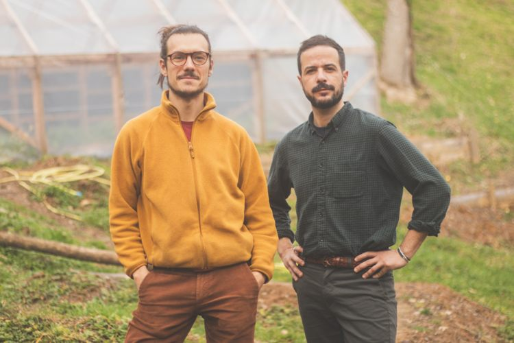

## description

La micro-ferme du Val d'Arac est située à 750m d'altitude à Massat. Inspirée par la permaculture, elle pratique un maraîchage agroécologique (en cours de certification AB). La ferme abrite un petit élevage de poules pondeuses de race Gasconne. Gérée par Étienne Rouet et Tarek Bellefqih, elle valorise une agriculture locale, durable et respectueuse de l'environnement.

