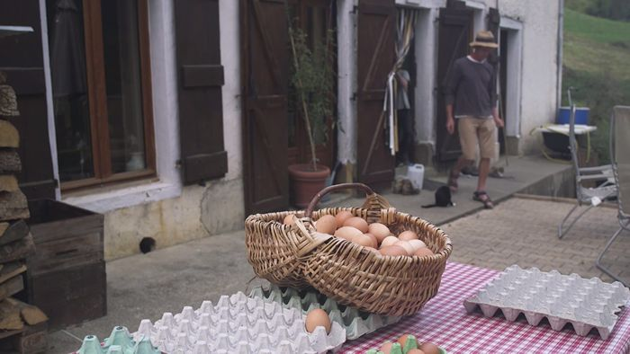

## description

Bart Saelen et son épouse Maryann sont les propriétaires de la ferme O'Naturel, une petite exploitation agricole avec environ 250 poules pondeuses produisant en moyenne 200 œufs par jour. Il et elle utilisent un modèle de pâturage en rotation inspiré par Joel Salatin, qui favorise une agriculture régénérative et respectueuse de l'environnement. Ce modèle est également suivi par Richard Perkins de Ridgedale Permaculture en Suède. Leur approche met l'accent sur le bien-être animal et la qualité des produits.

