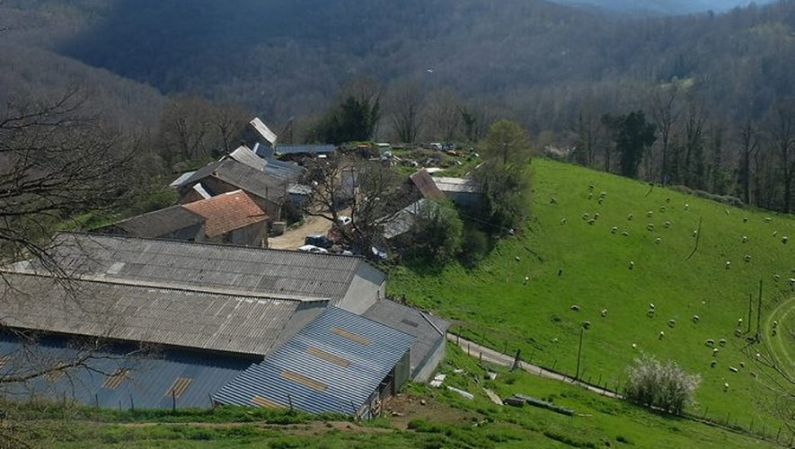

## description

Le GAEC de Galas d'en Haut, situé à Aleu, est la dernière exploitation agricole de la commune. Cette ferme familiale est engagée dans le respect des traditions et de l'environnement, et met en valeur les pratiques agricoles locales dans les Pyrénées Ariégeoises. La ferme est soutenue par une forte solidarité communautaire qui vise à préserver ce patrimoine et à continuer l'héritage de générations d'agriculteurs. Leur objectif est de maintenir un élevage durable et de réorganiser les activités pour assurer la pérennité de l'exploitation.

