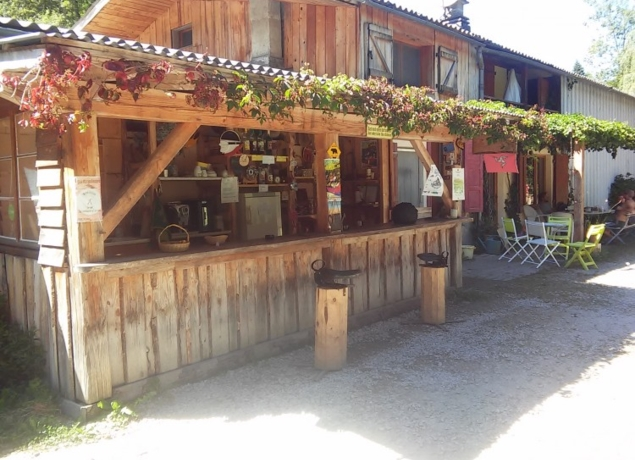

Le camping de l'Azaïgouat ouvert depuis 1998 propose une étape intéressante pour les randonneurs et autres (motards), avec 3 hectares de terrain, une salle commune de 200 mètres carrés, c'est un petit coin de paradis coupé du village par la forêt. Vous pourrez trouver dans la période estivale divers produits fait maison comme: des confitures, du cidre, du jus de pomme. Durant le reste de l'année Philippe propose un service de scierie.
