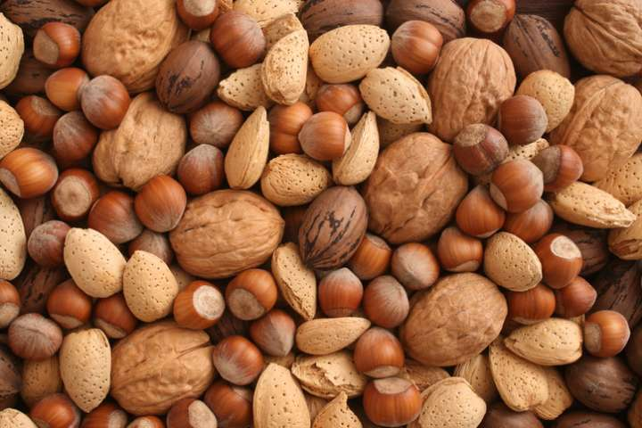

## description

Fabien Roidor, de la Gaule Souveraine, est un artisan passionné qui transforme des produits biologiques pour créer des pâtes à tartiner, confitures, crèmes de cacahuètes et purées d'amandes de haute qualité. Dans son laboratoire de transformation, équipé de meules et de torréfacteurs, il veille à chaque étape de la production pour garantir des produits savoureux et respectueux de l'environnement. Ses recettes mettent en valeur le goût authentique des ingrédients, tout en respectant les principes de l'agriculture biologique et de l'éthique artisanale. 

