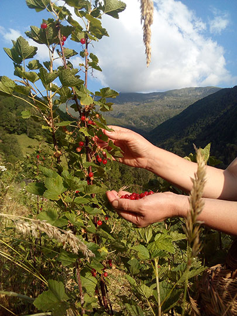

## description

Nous sommes des petits producteurs situés en montagne. Notre lieu de production s'accorde avec notre philosophie de vivre de la terre et au rythme des saisons. Nos fruits rouges sont cultivés à la main, sur des terrasses soutenues par des murs en pierres sèches, sur une surface de 8000m2, rénovées dans le cadre du programme départemental "1001 Terrasses d'Ariège". Nous transformons artisanalement nos fruits et travaillons dans l'esprit de sauvegarder leur qualité gustative.Nous aimons vendre nos produits en direct, pour mieux les présenter et les valoriser. Les appréciations de notre clientèle nous encouragent beaucoup !

