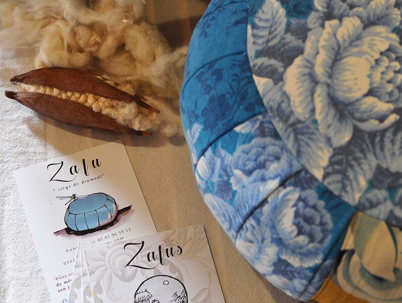

## description

Anne Rigot est l'artisane derrière Zafus et Futons, une marque spécialisée dans la couture nomade et la fabrication sur mesure de zafus, futons, couettes, oreillers et autres articles de méditation. Parmi les matières qu'elle utilise, Anne intègre à certaines de ses créations la laine de Lisa, apportant une touche unique et locale. Utilisant des matières naturelles comme la laine de mouton, le kapok, et des tissus en coton bio, Anne crée des produits respectueux de l'environnement. Chaque pièce est confectionnée avec soin, souvent inspirée par des pratiques traditionnelles telles que le kolam indien.

