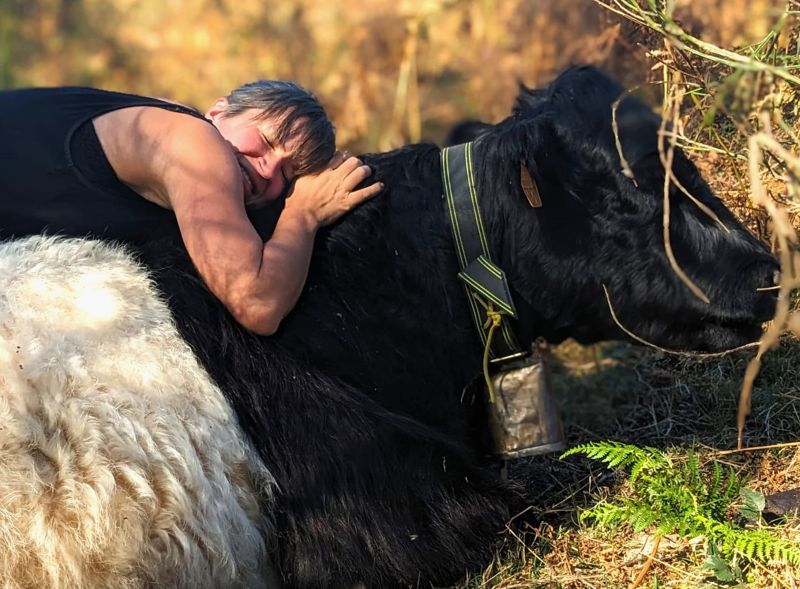

## description

Une alimentation équitable, respectueuse des animaux et produite localement avec un œil pour la nature dans la région est l'une des valeurs fondamentales de Chez Judith.
Les vaches paissent en hiver sur les nombreux champs autour de la ferme, et quand il neige, elles peuvent se retirer dans une écurie sèche. En été, les vaches se dirigent vers les montagnes, où elles paissent dans les estives et contribuent ainsi au processus de régénération sur ces prairies. Une merveilleuse collaboration entre les personnes, les animaux et la nature dans laquelle le bien-être des animaux et l'espace pour la nature jouent un rôle important.

