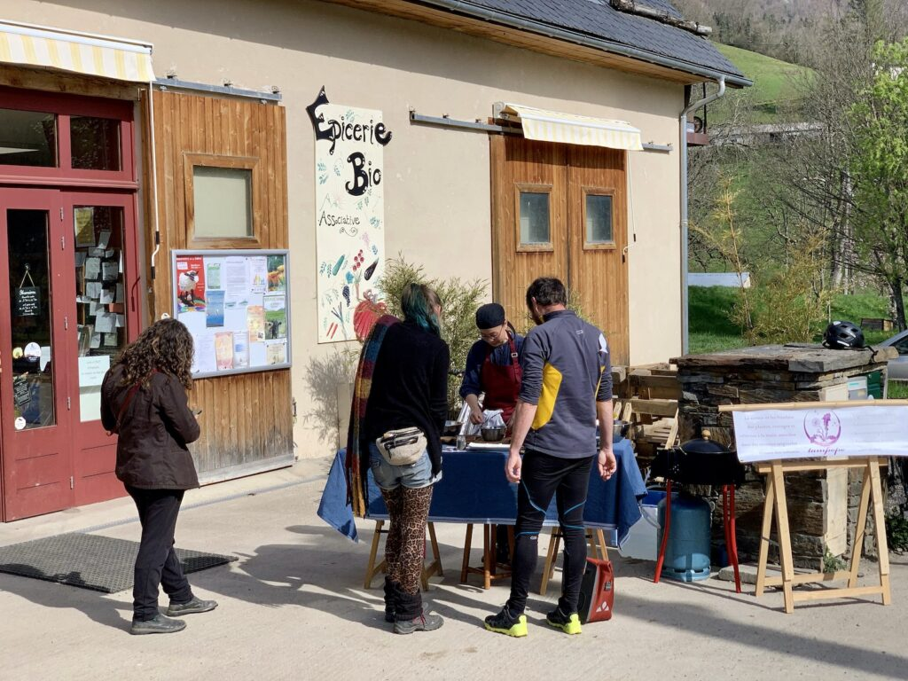

## description

Le Jardin des 7 Vallées est une épicerie associative à Massat qui, depuis plus de 30 ans, joue un rôle central dans la dynamisation du commerce local et la promotion des circuits courts. En valorisant les productions locales, elle soutient les petits producteurs de la vallée, offrant des produits variés tels que fruits, légumes, fromages, pains, viandes, et cosmétiques. Ces produits sont biologiques ou en conversion.

L'épicerie est un lieu d'échanges, de rencontres et de partage. En travaillant directement avec les producteurs locaux, elle tente de renforcer le lien social et l'économie locale.

