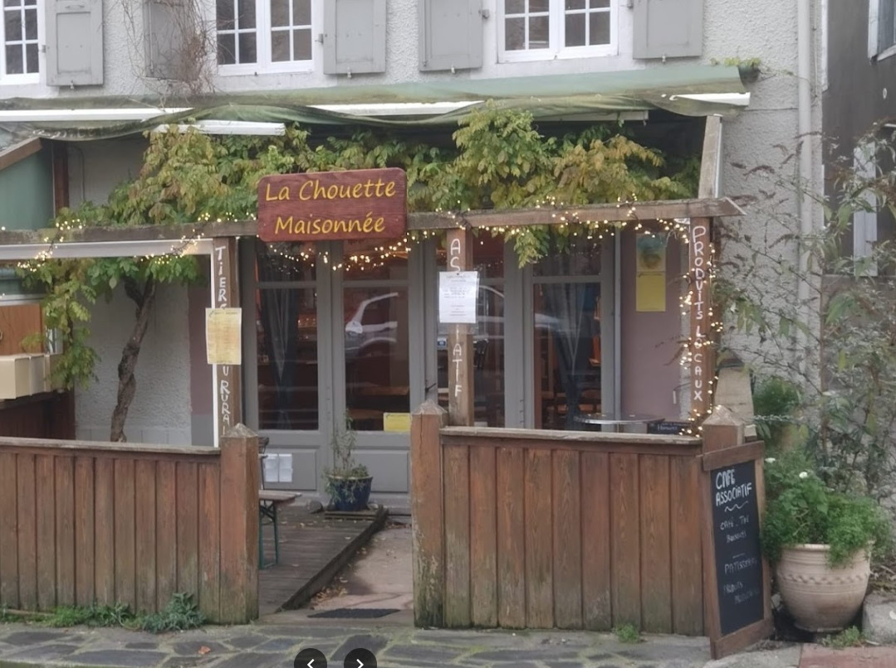

## description

Bien plus qu’un simple café associatif, La Chouette Maisonnée est un lieu-vitrine pour les producteurs locaux de la vallée ! Ici, vous trouverez des produits d'épiceries et des créations artisanales, cultivés et fabriqués avec passion par des personnes engagées de notre territoire.

L’équipe de bénévoles sympas vous propose une pause gourmande, café, chaï, thé, tartes et maintient un espace cosy ouvert à toutes et tous, été comme hiver. Un spot idéal pour se ressourcer, échanger ou soutenir l’économie locale 🌱

