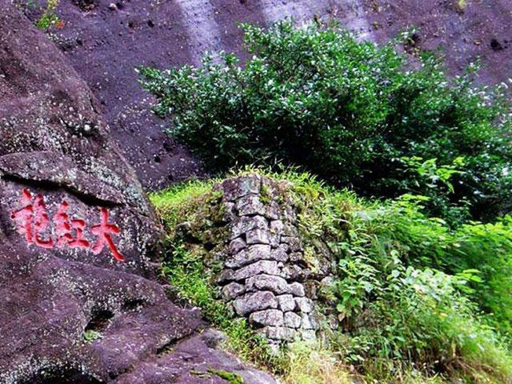

## description

Agnès est une passionnée de thé, elle propose des wulong, un liu bao 30 ans d'age, les feuilles roulées du thé noir thaïlandais : Hong Cha Roll. Son commerce est léger, discret sans prétention ce qui n'est pas le propos de ses thés. Je vous souhaite de la rencontrer et de vous laisser enchanter par ses liqueurs.

